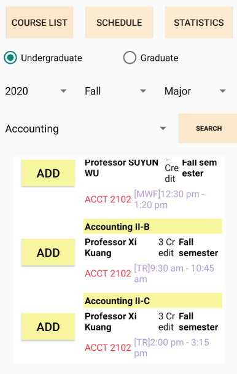

# README
Georgia Tech course app for android. Code is written in Java, using android studio.   
  
## Features
* Supports user login 
* Displays list of course information including course credit, course title, course professor, course area obtained from official school website
* Organized schedule UI with courses added by user 

## Download
App is compatible by Android Studio IDE. Download Android Studio on the website.\
https://developer.android.com/studio/?gclid=CjwKCAjwztL2BRATEiwAvnALcoU1zAM9rn1YpnosiEMck14E-qWX-3rd8rPy6ViCNr_kcof37GlDrhoCgSEQAvD_BwE&gclsrc=aw.ds

## Compile and Run
git clone https://github.com/cshim31/BuzzTime-Android-App.git \
Running app on linux is very hard, instead you need to launch the downloaded android studio IDE, open the cloned project and compile it. \

## Database
User login and course information are stored in a private database. Private database is likely to be expired, and therefore if you'd like to use your own database, User might need to write their own php file to enable the login function.

